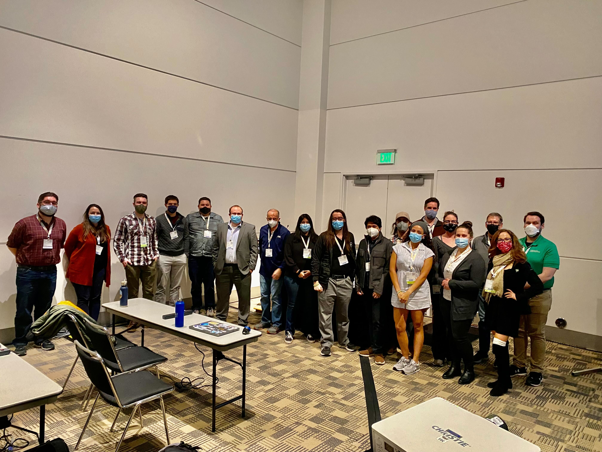
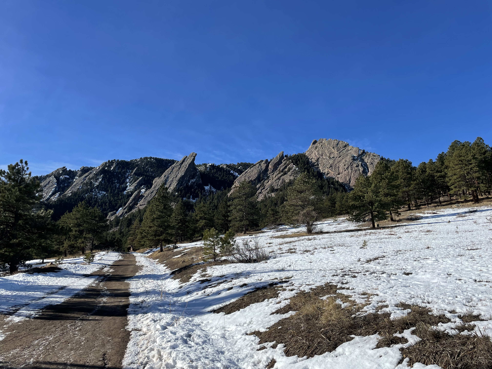

# AMS 2023 Reflections: Thank You Denver (and Boulder)!

Last week, I attended the 103rd American Meteorological Society Annual Meeting in Denver Colorado. Prior to attending, I put together a blog post detailing my pre-conference thoughts and expressed a high level of excitement for this year’s conference. It did not disappoint. The week was full of meaningful connections with colleagues, leading an open science short course, and attending sessions where I learned new tools and techniques for working with atmospheric and climate datasets.

## The Short Course
The week started off with our “Open Science in the Rockies: Working with ARM Data from the Surface Atmosphere Integrated Field Laboratory” short course, with over 20 attendees! A good amount of preparation went into the course, from meeting room logistics, inviting speakers, and testing the cyberinfrastructure that would allow participants to analyze large datasets while on a limited conference internet network. The course started with an overview of the SAIL field campaign, quickly diving into ways to access the data and analyze the datasets using open-source tools funded and supported by ARM! We also covered advanced data visualization techniques using the Pangeo stack, including using Xarray and the Holoviews tools to visualize an entire day’s worth of high spatiotemporal cloud radar data.

My favorite part of the course covering that last section. One participant even used the open-source cookbooks as inspiration for his talk later in the week during the SAIL-specific AMS session, acknowledging where he had learned how to create the figure. Enabling the science community is what these courses are all about.

Here is a group picture of the attendees and instructors:

## The Conference
As a member of the Environmental Information Processing Technologies committee, I helped co-chair quite a few sessions, with topics ranging from tools for research to operations to part of the AMS Python Symposium! One of the more notable moments during the Python symposium was Monday afternoon’s session, where Tom Nicholas (developer of several Pangeo-related packages) asked the room “Who here has used and is familiar with Xarray”? Almost everyone in the room raised their hand. This contrasts with last in-person meeting, the 100th AMS Annual Meeting in Boston, where there were still quite a few people working on adopting Xarray within their workflows. It was also astonishing how many presentations explicitly mentioned their tools are built around Xarray. Another common theme during the Python Symposium was the impact Project Pythia is having on the community, and how many presenters are interested in contributing cookbooks or improving the existing content.

After each day of sessions, attendees flocked to different social events, with most focused-on alumni or general AMS-hosted networking opportunities. The Valparaiso University meteorology reception on Monday was my favorite social event that week. I connected with current undergraduates, discussing with them their career goals and what their plans after Valpo are, as well as reconnecting with alumni through the years. It’s amazing how much this event has grown since my first AMS Valpo reception in Austin in 2018. 

## The Pangeo Working Meeting
Something new at this year’s AMS Annual Meeting was the post-conference working meeting, where members of the Pangeo community gathered to collaborate on projects. The day was structured as a collection of breakouts, focused around:
-	[Xarray](https://xarray.dev/) and Friends (Xarray and associated packages)
-	[Project Pythia](https://projectpythia.org/) (Educational cookbooks and feedback on content)
-	[Pangeo Forge](https://pangeo-forge.org/) (Analysis Ready Cloud Optimized (ARCO) data conversion)
-	[Xbatcher](https://xbatcher.readthedocs.io/en/latest/) (Toolkit for generating AI/ML batches from Xarray data structures)
In addition to the topics listed above, we had even smaller breakouts related to improving documentation and tutorials when it comes to Xarray + Dask (at the intermediate level), and fixed some bugs in Intake-ESM!

## A Weekend in Boulder
I decided to extend the trip by a couple of days, staying near Boulder Saturday and Sunday. Some of my best friends still live in that region. Friday night, I joined some friends at Rayback Collective, finding dinner at one of the local food trucks. Saturday was an ideal day: breakfast at my favorite diner in Downtown Louisville (B.O.B.’s Diner), hiking along Mount Sanitas, and lunch (and beverages) at Avery Brewing Company, followed by a night along Pearl Street. Reconnecting with my friends in Colorado was both restorative and relaxing! I had smooth travel day on Sunday, spending some time at the new lounging area at the end of the A terminal at Denver’s airport.

Here is a picture from my Boulder adventure:

## Conclusions
The 103rd AMS Annual Meeting was successful. Between the short courses, symposiums, and post-conference working meeting, I feel as though real progress was made in terms of open science this week. I am thankful Denver is on the new rotation of meeting locations (extending through 2032). It is an amazing city, with a convenient colocation of hotels, restaurants, collaborators, and friends.
