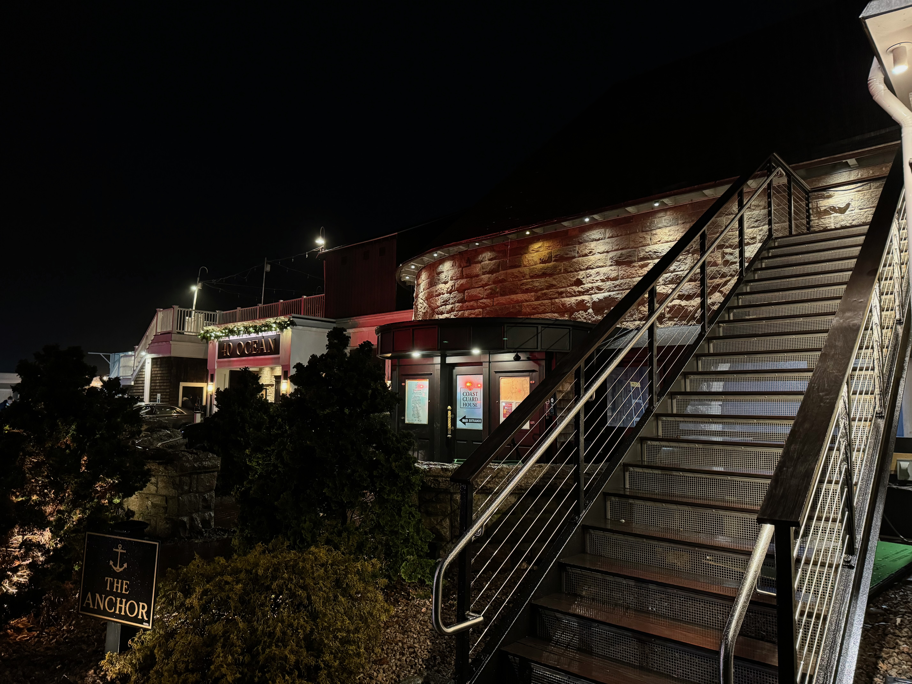

# Argonne Instruments at WFIP3: Days 3-4: A Full Weekend

## The Nantucket Tower
We had a busy weekend deploying more instruments that are collecting data for the field observation portion of the 3rd Department of Energy funded Wind Forecast Improvement Project, which focuses on offshore wind regions off the coast of New England. On Saturday, we spent a bulk of the day putting the final touches on the 10 meter meteorology tower, shown below.

This meteorology tower includes sonic anemometers (the big claw machine looking devices) at 10 meters (right portion of the picture) and 5 meters (left portion of the picture). These devices send ultrasonic sounds from each of those claws, and measure how the sound interacts with the air, which gives an estimate of the wind direction and speed, in all directions. These high resolution measurements are helpful when looking at how the surface interacts with the air above it, a key focus for this field experiment!

While we were able to install all of the instruments on the tower, and test that they were collecting data, we were not able to fully raise the tower. We plan to return later this week (hopefully) to raise the tower.

## Traveling to Martha’s Vineyard
After securing all of our instruments at Nantucket, we traveled to the docks to catch the ferry back to the mainland, en route to our next site in Martha’s Vineyard. Before hopping on the boat, we grabbed a quick bite at Stubby’s, which had tasty sandwiches to go! The outside was well decorated, the food was phenomenal, and service was quick!

After arriving in Hyannis, we drove to catch the next ferry at Woods Hole. Unfortunately we didn’t make the earlier ferry, so we needed to take the next one, which led to us arriving later than expected in Oak Bluffs, a town in Martha’s Vineyard. This is also why I did not have a chance to put together a blog post last night! I was quite exhausted.

## Onto the Martha’s Vineyard Site
I started the morning with a nice walk along the shoreline in Oak Bluffs, watching the calm before the storm. After breakfast in my room at the hotel, we visited the field site, Martha’s Vineyard Coastal Observatory which is operated by the Woods Hole Oceanographic Institution (WHOI). They provided a fenced area for us to set up the Mini Micropulse Lidar, an instrument that is helpful for looking at small particles in the atmosphere, especially those in the layer closest to the Earth’s surface. The instrument is up and running, and is already giving us vertical profiles of the atmosphere (pictured below)!

## Off to Rhode Island
After wrapping up in Martha’s Vineyard, we took the ferry back to Wood’s Hole and set our GPS to Narragansett, Rhode Island, which was our anticipated next site. We grabbed dinner at The Coast Guard House, a convenient walk across the street.

While we will not deploy tomorrow due to high winds and heavy rain, we will have a chance to run to the store to grab additional supplies required for other sites this week, as well as take a look at the data from instruments already running (the Sodar and mini micropulse lidar).