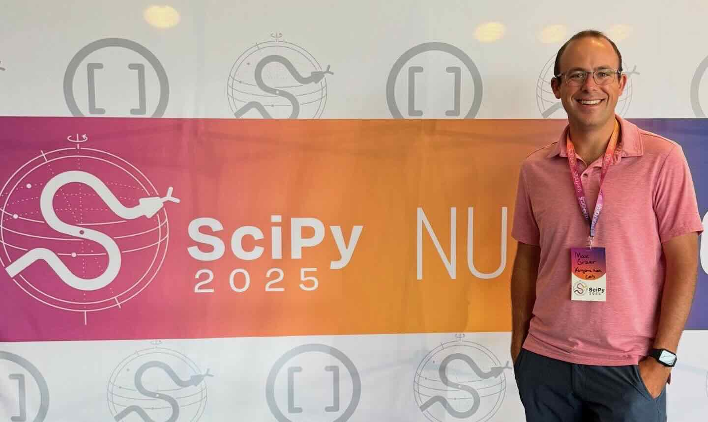
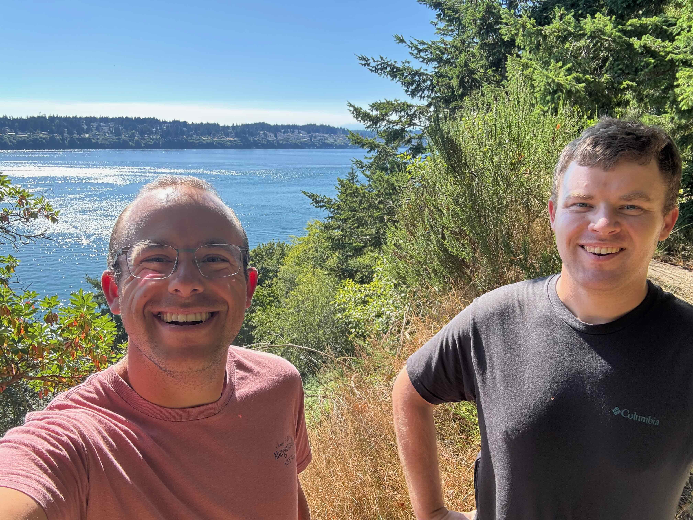
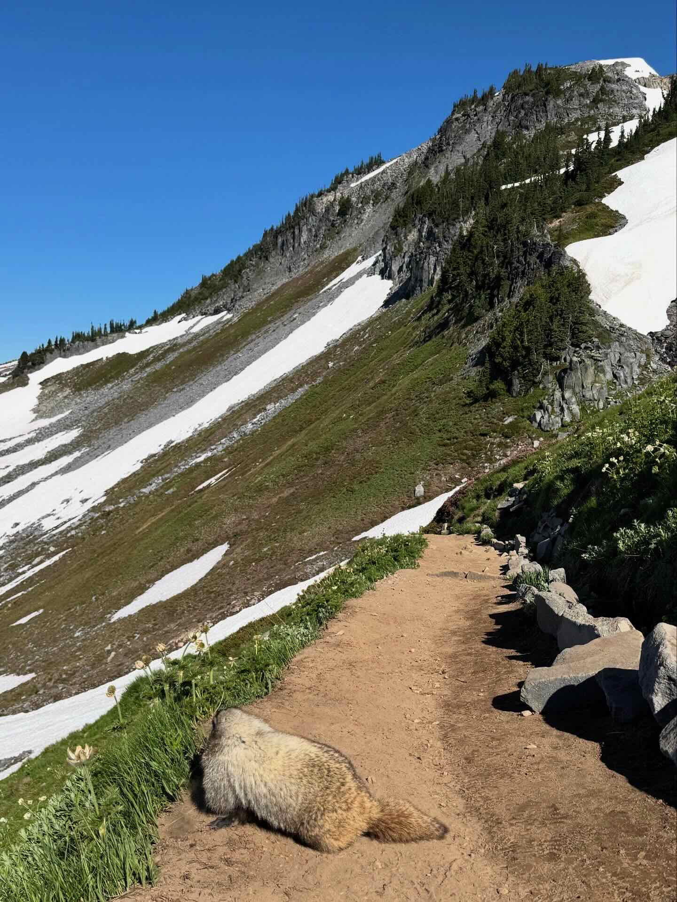

# SciPy 2025 🐍

:::{caution}
This blog post expresses my own personal opinion, not that of my employer.
:::

:::{figure}
:label: scipy-selfie
:align: left

(main_image)=

:::

## What is SciPy?

The term SciPy refers to multiple things - mainly:
- [SciPy the Project](https://scipy.org/)
- [SciPy the Community](https://scientific-python.org/)
- [SciPy the Conference](https://www.scipy2025.scipy.org/)

This week brought together all three; with the general event being SciPy the conference, consisting of tutorials, talks, and sprints! It brought together multiple disciplines together for the week, ranging from astronomers and physicists to geoscientists like myself. The one thing we all have in common is our passion for the scientific python programming language and the associated community that we all love.

## The Tutorials

I spent the first couple days at tutorials. Two of the sessions I attended particularly stood as opportunities to improve the way I work! 

### Projects with Pixi


The first being pixi; for those who are not familiar with pixi, it is a software environment tool that empowers more reproducible workflows regardless of the operating system. If you are interested in getting started with pixi, please use the following steps

::::{tab-set}
:::{tab-item} Mac/Linux
:sync: tab1
```bash
curl -fsSL https://pixi.sh/install.sh | sh
```
:::
:::{tab-item} Windows
:sync: tab2
```bash
powershell -ExecutionPolicy ByPass -c "irm -useb https://pixi.sh/install.ps1 | iex"
```
:::
::::

After restarting your shell, you can start with your first project using:

```bash
pixi init my_project
```

I encourage you to look more into their [Python project tutorial section](https://pixi.sh/latest/python/tutorial/) as well as their [switching from mamba/conda guide](https://pixi.sh/latest/switching_from/conda/)

### Large Language Models in Python

"Building with Large Language Models (LLMs) Made Simple" was another fascinating tutorial! I have only ever used ChatGPT (or similar LLM tools) from their web interface until Monday. 

You can download the materials locally using the following:

```bash
git clone https://github.com/ericmjl/building-with-llms-made-simple
cd building-with-llms-made-simple
pixi run start # You alread have this installed if you followed the previous suggestion!
```

This tutorial made use of marimo notebooks, which is not necessarily a new project, but a tool I have yet to use! The key difference between these are typical Jupyter notebooks is that marimo notebooks are:
- Python scripts that can include specific dependencies directly in that script
- Restrictive on redefining variables in different code blocks
- Much easier to track on GitHub since they are not json

[Here is a link to marimo documentation if you are interested!](https://marimo.io/)


## The Conference
The conference officially kicked off on Wednesday morning, with a keynote address and the tracks quickly following that. While specific tracks vary by year, one of the constants is the Earth, Geo, Ocean, Climate, and Atmospheric Science track. I have served as co-chair of this part of the conference for the last few years; recruiting abstract submissions and curating a set of talks that will interest the broader community.

### The Earth, Ocean, Geo, Climate, and Atmospheric Science Track
I would like to highlight the Earth Geo track talks for anyone interested! The main talking points from this part of the symposium is that the [Pangeo stack](https://pangeo.io/) (ie. xarray and friends) is continuing to improve, becoming both more flexible, scalable, and consistent!
- [Python for Climate Science: Using Intake to provide easy access to Climate Model data](https://cfp.scipy.org/scipy2025/talk/BJL3U3/)
- [Breaking Out of the Loop: Refactoring Legacy Software with Polars](https://cfp.scipy.org/scipy2025/talk/HK3AAQ/)
- [Cubed: Scalable array processing with bounded-memory in Python](https://cfp.scipy.org/scipy2025/talk/P8B77T/)
- [Using Discrete Global Grid Systems in the Pangeo ecosystem](https://cfp.scipy.org/scipy2025/talk/ELZLHP/)
- [tobac: Tracking Atmospheric Phenomena on Multiscale, Multivariate Diverse Datasets](https://cfp.scipy.org/scipy2025/talk/ETWXLC/)
- [VirtualiZarr and Icechunk: How to build a cloud-optimised datacube of archival files in 3 lines of xarray](https://cfp.scipy.org/scipy2025/talk/JBNR9A/)
- [The brave new world of slicing and dicing Xarray objects.](https://cfp.scipy.org/scipy2025/talk/Z7AL7K/)

### Lightning Talks
Each afternoon, SciPy has a tradition of holding 5-minute lightning talks ⚡, wherein potential presenters submit their name and title of their talk in a bin at the NumFocus Booth for a chance to present. Organizers then pull these slips of paper at random during the session! Presenters do not know they are up to present until minutes before. There is a bit of humor mixed in - where non-first-timers spin a wheel-of-doom which determines an obstacle that they must incorporate into their talk! Obstacles include
- The dreaded lobster claw 🦞 (a claw for hands, often reeking havoc on typing)
- 1-2 minutes chopped off of their allotted time
- Making an animal noise of the organizers' choosing

This was the first year I presented a lightning talk! Mine was focused on organizing a theoretical Jimmy Buffett Summer School, using the template I worked on as a part of the Hack-the-Hackathon event last fall. The template provides all you need to stand up a Github-hosted website with connections to executable environments, checklists for preparation, and suggested schedules! If you are interested in these resources, please see the following links
- [Cookiecutter-based template, command line based](https://github.com/hackthackathon/hackathon-template-cookiecutter)
- [Github template, non-command line](https://github.com/hackthackathon/hackathon-template-github)


## Exploring Tacoma and Seattle
I took some time to explore the Tacoma/Seattle area. If I had **any advice** for first-time SciPy attendees, it's that ***you do not need to, nor should you, attend every single session***. Take time for yourself, especially your mental health, and [explore the region](#scipy-exploring-images)! Some highlights of exploring included:
- Watching [float planes](#float_plane_tacoma) take off and land along Puget Sound
- Catching up with a graduate school friend while [hiking around Point Defiance](#hiking_point_defiance)
- A day hike at [Mount Rainier National Park](#mount_rainier)

:::{figure}
:label: scipy-exploring-images
:align: left

(float_plane_tacoma)=

(hiking_point_defiance)=

(mount_rainier)=

:::

## Conclusions
I love SciPy so much. It has given a great amount: friends, community, inspiration, and most of all a sense of belonging. I count down to SciPy every year - an opportunity to come together with our community and reconnect. While it was a smaller event this year, filled with broad uncertainty regarding the future of open source/science support, it was a breath of fresh air that was sorely needed. I feel a new sense of inspiration returning to Chicago, hopeful our community will continue to grow, improve, and carry on. 